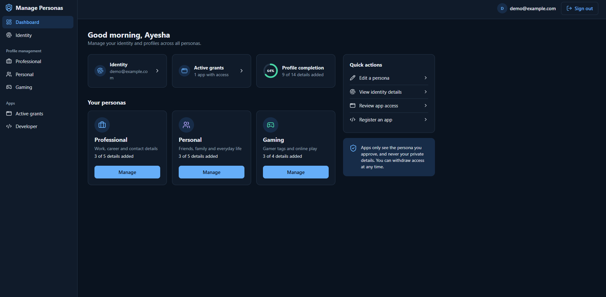
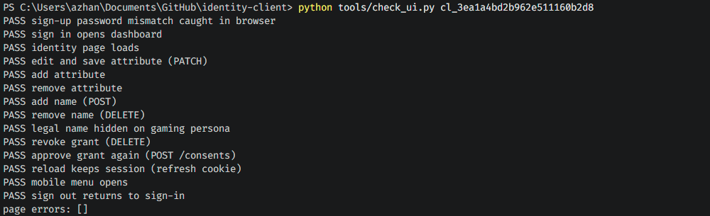

# Front End

## for centralised API for user profile and identity management

A user can sign in, switch between the three personas, edit attributes and names, approve a client on the authorisation screen, and withdraw a grant in one click.

## New UI - Version 1.1

Nothing changes on Cloudflare Pages. The build command is still npm run build and the output folder is still dist. The production build loads one CSS file and one JavaScript file from the same origin. It was served with the CSP from Step 6.2 and the browser reported no CSP errors.

### Redesign Test Result

| # | Check | Result |
| :-: | :--- | :-: |
| 1 | Sign-up password mismatch is caught in the browser | Pass |
| 2 | Sign-in opens the dashboard | Pass |
| 3 | Identity page loads | Pass |
| 4 | Edit and save an attribute (PATCH) | Pass |
| 5 | Add an attribute | Pass |
| 6 | Remove an attribute | Pass |
| 7 | Add a name (POST) | Pass |
| 8 | Remove a name (DELETE) | Pass |
| 9 | Legal name hidden on the Gaming persona | Pass |
| 10 | Revoke a grant (DELETE /consents/{id}) | Pass |
| 11 | Approve a grant on the authorisation screen (POST /consents) | Pass |
| 12 | Reload keeps the session (refresh cookie) | Pass |
| 13 | Mobile menu opens at 390 px width | Pass |
| 14 | Sign-out returns to the sign-in page | Pass |

These checks ran in Chromium with Playwright against the real API. The script is included as `tools/check_ui.py`.

## Optional: Future Features (Not Needed for Submission)

The mock-up shows the items below. Each one needs new server code, new data, or a third-party account, so each one would change functionality. Leave them out of the current build. If you add one later, build and test the server part first, then add the screen.

| Feature in mock-up | What it would need |
| :--- | :--- |
| Continue with Google | An OAuth or OpenID Connect client on the server, a Google Cloud project, and a way to link a Google account to a User |
| Forgot password | A reset-token table, an email service, and two new routes |
| Remember me | A second refresh-token lifetime chosen at sign-in |
| "Verified" badges for email or phone | A verification flow and a stored flag. A phone number field does not exist yet. |
| Full name on sign-up | Either a new field on `POST /users`, or a second call to the existing `POST /users/{id}/names` after sign-up |
| Notifications (bell icon) | An event table and a read or unread state |
| Activity log | A read-only route over the existing audit table, limited to the signed-in user |
| Followers, cover image, linked Steam or Discord accounts | New persona attributes or file storage. Linked accounts also need each platform's API. |

To add a new item to the sidebar later, add one object to `MAIN_LINKS` or `APP_LINKS` in `AppShell.jsx` and one route in `App.jsx`.